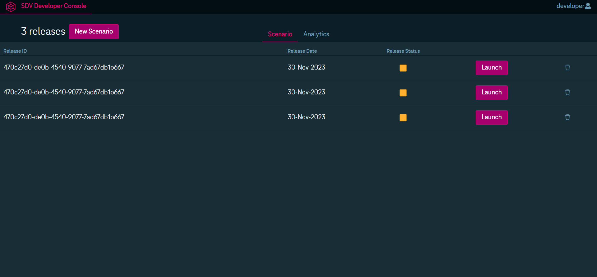
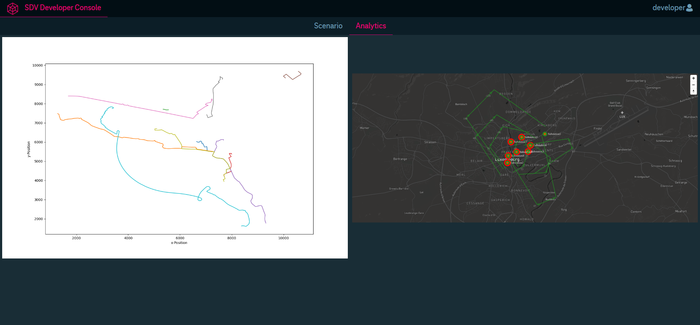

Eclipse-DCO Battery Simulation Hack-Challenge:

# ChargeLifeBalance

Assessing the impact of charging electric vehicles on power grids and energy demand with open-source simulation software. 

Introducing our innovative open-source software, utilizing the DCO console, SUMO, and PowSyBl simulators. It dynamically simulates real-time scenarios for vehicle movement, battery life, and power grid loads, making it invaluable for city planning, power grid optimization, and EV charging station placement by real estate owners. The tool is a versatile resource for educational purposes, enabling users to explore urban planning complexities. With a commitment to openness, it invites global collaboration, ensuring continuous improvement and adaptability to emerging technologies. Our software is a pioneering solution shaping a sustainable and interconnected future.

Team ZENITH
SDV Eclipse Hackathon 2023


Eclipse Developer Console UI




Eclipse SUMO


Architecture


# Key Features

1. Adaptive Charging Time Based on Traffic:
Our software boasts an intelligent feature that dynamically adapts charging times in response to real-time traffic conditions. By capitalizing on off-peak hours, it optimizes charging schedules, potentially reducing overall charging time. This not only enhances the user experience but also contributes to effective grid load management, ensuring efficient energy utilization.

2. Real-Time Power Grid Load Analysis (in development):
Gain comprehensive insights into power grid dynamics with our real-time load analysis feature. The software meticulously assesses and visualizes power grid loads within a specified area, empowering users to make informed decisions regarding infrastructure upgrades and optimizations. This functionality is invaluable for power grid planning, ensuring the seamless integration of electric vehicles into existing systems.

3. Educational Simulation Capabilities:
Beyond its practical applications, our software serves as a robust educational tool. Students and researchers can explore diverse scenarios related to urban planning, transportation, and energy systems. This feature fosters a deeper understanding of the complexities inherent in sustainable development and aligns with our commitment to knowledge-sharing and community-driven progress.

4. Open-Source Collaboration:
Embracing the spirit of collaboration, our software is entirely open-source. This key feature invites developers worldwide to contribute, innovate, and enhance the software's capabilities. By fostering a global community, we ensure that the tool remains at the forefront of technological advancements, providing users with the latest features and optimizations.


# Need to know / Tech Stack

- Git
- Maven
- Java Spring Boot
- NextJS React

# Installation and Pre-requisites

## 1. Install DCO
  follow README_DCO.md for more information.
## 2. Install SUMO
```bash
docker compose up -d
```
## 3. Install PowSYBL

https://github.com/powsybl/powsybl-incubator/blob/network_map_viewer_vitejs/network-map-viewer/README.md

# All necessary links / more info

- Eclipse SDV Developer Console: https://gitlab.eclipse.org/eclipse/dco/developer-console
- Eclipse SUMO: https://github.com/eclipse-sumo/sumo
- PowSyBI :https://github.com/powsybl
